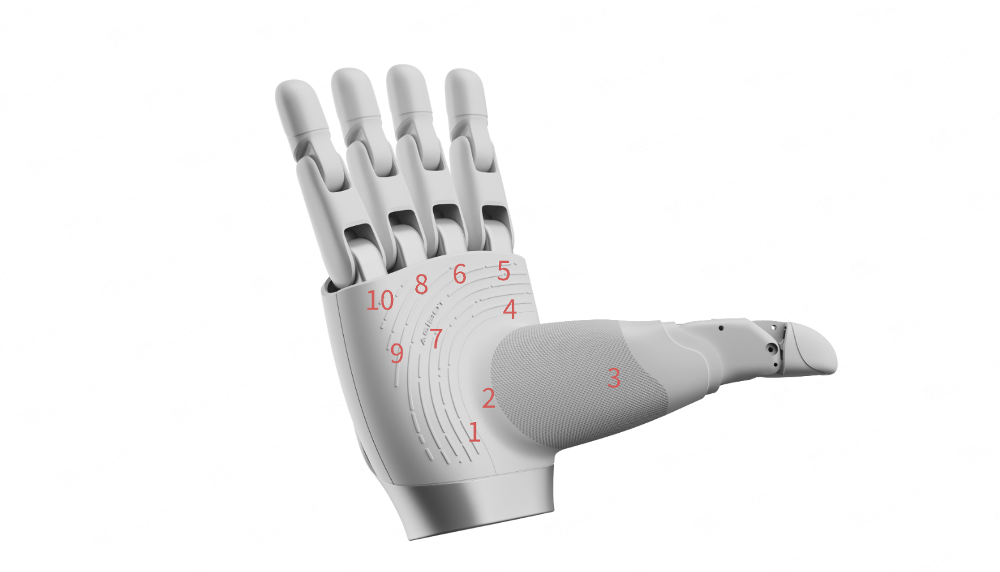

# OmniHand 2025 SDK

[中文文档](README_zh_cn.md)

## Quick Links

- 📖 **[Quick Start Guide](doc/en/QUICK_START.md)** - Get started in 5 minutes
- 🔧 **[Troubleshooting](doc/en/TROUBLESHOOTING.md)** - Common issues and solutions

## Overview

The OmniHand 2025 SDK supports three product models:

**OmniHand 2025 灵动款 (O10)**: A compact, high-DOF interactive dexterous hand featuring `10 active + 6 passive degrees of freedom`. Weighing only 500g, it utilizes CANFD communication interfaces and is equipped with `400+ tactile points and 0.1N array resolution, with maximum fingertip force of 5N`. It's suitable for various humanoid robots and robotic arms. Its compact, lightweight design and rich tactile interaction capabilities make it valuable for interactive services, research, education, and light-duty operations.

**OmniHand Pro 2025 专业款 (O12)**: A 12-degree-of-freedom professional dexterous hand featuring precise operation and flexible control capabilities. It is equipped with tactile sensors and multiple control modes (position control, torque control, hybrid control), making it suitable for a wide range of applications including research and education, entertainment and commercial performances, exhibition guidance, and industrial scenarios.

**OmniHand Dex UMI (O10 UMI)**: A read-only dexterous hand using UMI protocol, supporting periodic position and tactile sensor data reporting.

## Dexterous Hand Motor Index

**OmniHand 2025 灵动款 (O10)**: Has 10 degrees of freedom, indexed from 1 to 10. The corresponding control motors are shown in the following image:

**OmniHand Pro 2025 专业款 (O12)**: Has 12 degrees of freedom, indexed from 1 to 12. The corresponding control motors are shown in the following image:

## Platform-Specific Documentation

- **[Linux (x64)](linux/x64/README.md)** - Installation, USB setup, ROS2
- **[Windows (x64)](windows/README.md)** - Installation, driver setup

## API Documentation

### C++ API
- [C++ API Index](doc/en/API_CPP.md)
- [OmniHand 2025 (O10) C++ API](doc/en/API_CPP_O10.md)
- [OmniHand Pro 2025 (O12) C++ API](doc/en/API_CPP_O12.md)
- [OmniHand Dex UMI (O10 UMI) C++ API](doc/en/API_CPP_O10_UMI.md)

### Python API
- [Python API Index](doc/en/API_PYTHON.md)
- [OmniHand 2025 (O10) Python API](doc/en/API_PYTHON_O10.md)
- [OmniHand Pro 2025 (O12) Python API](doc/en/API_PYTHON_O12.md)
- [OmniHand Dex UMI (O10 UMI) Python API](doc/en/API_PYTHON_UMI.md)

### Kinematics API
- [OmniHand 2025 (O10) Kinematics C++](doc/en/API_KINEMATICS_CPP_O10.md)
- [OmniHand 2025 (O10) Kinematics Python](doc/en/API_KINEMATICS_PYTHON_O10.md)
- [OmniHand Pro 2025 (O12) Kinematics C++](doc/en/API_KINEMATICS_CPP_O12.md)
- [OmniHand Pro 2025 (O12) Kinematics Python](doc/en/API_KINEMATICS_PYTHON_O12.md)

### ROS2 Interface (Linux Only)
- [ROS2 API Index](doc/en/API_ROS2.md)
- [OmniHand 2025 (O10) ROS2 Interface](doc/en/API_ROS2_O10.md)
- [OmniHand Pro 2025 (O12) ROS2 Interface](doc/en/API_ROS2_O12.md)

## License

Mulan PSL v2 - Copyright (c) 2025, Agibot Co., Ltd.
