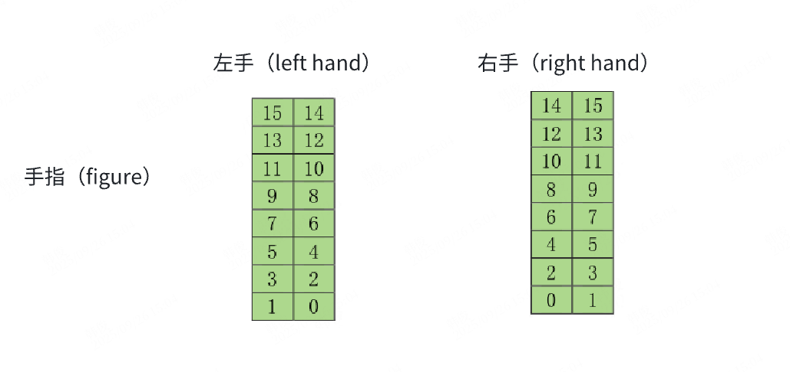

# OmniHand 2025 (O10) C++ API

## Overview

**OmniHand 2025 (O10)** is a 10 DOF dexterous hand with 1D tactile sensors. This document describes the C++ API for controlling and interacting with OmniHand 2025 devices.

**Key Features:**
- 10 active + 6 passive degrees of freedom
- 1D tactile sensors (fingers, palm, dorsum)
- Motor position range: 0-4096
- Supports CAN (ZLG USB CANFD) and RS485 communication
- Supports SocketCAN (Linux only)

## Include Header

```cpp
#include "omnihand/omnihand_2025.h"
using namespace agilink::omnihand;
```

## Enums

### HandType

```cpp
enum class HandType : unsigned char {
    LEFT = 0,      // Left hand
    RIGHT = 1,     // Right hand
    UNKNOWN = 255  // Unknown hand type
};
```

### Finger

```cpp
enum class Finger : unsigned char {
    THUMB = 0x01,    // Thumb
    INDEX = 0x02,    // Index finger
    MIDDLE = 0x03,   // Middle finger
    RING = 0x04,     // Ring finger
    LITTLE = 0x05,   // Little (pinky) finger
    PALM = 0x06,     // Palm
    DORSUM = 0x07,   // Dorsum (back of hand)
    UNKNOWN = 0xff   // Unknown
};
```

### ControlMode

```cpp
enum class ControlMode : unsigned char {
    POSITION = 0,    // Position mode
    SERVO = 1,    // Servo mode
    VELOCITY = 2,    // Velocity mode
    TORQUE = 3,    // Torque mode (Not supported: pure torque control not available)
    POSITION_TORQUE = 4,    // Position-Torque mode (Mixed control: position + torque)
    VELOCITY_TORQUE = 5,    // Velocity-Torque mode (Mixed control: velocity + torque)
    POSITION_VELOCITY_TORQUE = 6,    // Position-Velocity-Torque mode (Mixed control: position + velocity + torque)
    UNKNOWN = 10    // Unknown mode
};
```

**Note**: 
- **SERVO mode (1)**: Servo control mode
- **Pure torque control (TORQUE) is not supported**: Use mixed control modes (POSITION_TORQUE, VELOCITY_TORQUE, POSITION_VELOCITY_TORQUE) instead

## Data Structures

### VendorInfo

```cpp
struct VendorInfo {
    std::string productModel;     // Product model
    std::string productSeqNum;    // Product serial number
    Version hardwareVersion;      // Hardware version
    Version softwareVersion;      // Software version
    int16_t voltage;              // Supply voltage (mV)
    unsigned char dof;            // Degrees of Freedom (10 for O10)

    std::string toString() const;
};
```

### DeviceInfo

```cpp
struct DeviceInfo {
    unsigned char hand_device_id; // Hand device ID
    CommuParams commu_params;     // Communication parameters
    std::string toString() const;
};
```

### TactileSensorData

```cpp
struct TactileSensorData {
    Finger sensor_id_;           // Sensor ID (finger/palm/dorsum)
    std::vector<uint8_t> data_;   // Sensor data (unit: 1g, max: 255g)
};
```

## Factory Methods

### Recommended: ZLG USB CANFD (Zero Configuration)

```cpp
/**
 * @brief Factory method - CAN communication (ZLG USB CANFD) by canfd_device_id
 * @param hand_type Hand type (left/right)
 * @param hand_device_id Device ID (default: 1)
 * @param canfd_device_id USB CANFD adapter device index (default: 0)
 * @param canfd_channel_id CAN channel index (default: 0, USBCANFD-200U has 2 channels: 0 and 1)
 * @return A unique pointer to OmniHand2025 instance
 * @note Device type (200U/100U/MINI) is automatically detected internally.
 * @note ✅ Recommended: Zero configuration, ready to use out of the box. No root privileges required.
 */
static std::unique_ptr<OmniHand2025> createHandByZlgcan(
    HandType hand_type,
    unsigned char hand_device_id = 1,
    unsigned char canfd_device_id = 0,
    unsigned char canfd_channel_id = 0);
```

**Example:**
```cpp
auto hand = OmniHand2025::createHandByZlgcan(
    HandType::LEFT,
    1,      // hand_device_id
    0,      // canfd_device_id
    0       // canfd_channel_id
);
```

### Factory Method by Serial Number

```cpp
/**
 * @brief Factory method - CAN communication (ZLG USB CANFD) by serial number
 * @param hand_type Hand type (left/right)
 * @param hand_device_id Device ID
 * @param usbcanfd_serial_number USB CANFD device serial number (supports partial matching)
 * @param canfd_channel_id CAN channel index (default: 0). For dual-channel adapters (USBCANFD-200U): can0=0, can1=1. For single-channel adapters (USBCANFD-100U): always 0
 * @return A unique pointer to OmniHand2025 instance, or nullptr if device not found
 */
static std::unique_ptr<OmniHand2025> createHandByZlgcan(
    HandType hand_type,
    unsigned char hand_device_id,
    const std::string& usbcanfd_serial_number,
    unsigned char canfd_channel_id = 0);
```

### HCAN USB CANFD

```cpp
/**
 * @brief Factory method - HCAN USB CANFD communication by device ID
 * @param hand_type Hand type (left/right)
 * @param hand_device_id Hand device ID
 * @param canfd_device_id HCAN device index
 * @param canfd_channel_id CAN channel index (default: 0). For dual-channel adapters (USBCANFD-200U): can0=0, can1=1. For single-channel adapters (USBCANFD-100U): always 0
 * @return A unique pointer to OmniHand2025 instance
 */
static std::unique_ptr<OmniHand2025> createHandByHcan(
    HandType hand_type,
    unsigned char hand_device_id,
    unsigned char canfd_device_id,
    unsigned char canfd_channel_id = 0);
```

**Example:**
```cpp
auto hand = OmniHand2025::createHandByHcan(
    HandType::LEFT,
    1,      // hand_device_id
    0,      // canfd_device_id
    0       // canfd_channel_id
);
```

### Factory Method by HCAN Serial Number

```cpp
/**
 * @brief Factory method - HCAN USB CANFD communication by serial number
 * @param hand_type Hand type (left/right)
 * @param hand_device_id Hand device ID
 * @param hcan_serial_number HCAN device serial number (supports partial matching)
 * @param canfd_channel_id CAN channel index (default: 0). For dual-channel adapters (USBCANFD-200U): can0=0, can1=1. For single-channel adapters (USBCANFD-100U): always 0
 * @return A unique pointer to OmniHand2025 instance, or nullptr if device not found
 */
static std::unique_ptr<OmniHand2025> createHandByHcan(
    HandType hand_type,
    unsigned char hand_device_id,
    const std::string& hcan_serial_number,
    unsigned char canfd_channel_id = 0);
```

### RS485 Communication (O10 Only)

```cpp
/**
 * @brief Factory method - RS485 communication (OmniHand 2025 only)
 * @param hand_type Hand type (left/right)
 * @param hand_device_id Hand device ID
 * @param uart_port Serial port path (e.g., "/dev/ttyUSB0")
 * @param baudrate Baud rate (default: 460800)
 * @return A unique pointer to OmniHand2025 instance
 */
static std::unique_ptr<OmniHand2025> createHandByRs485(
    HandType hand_type,
    unsigned char hand_device_id,
    const std::string& uart_port,
    int32_t baudrate = 460800);
```

### Advanced: SocketCAN (Linux Only)

```cpp
#ifdef __linux__
/**
 * @brief Factory method - SocketCAN communication (Linux native CAN interface)
 * @param hand_type Hand type (left/right)
 * @param hand_device_id Device ID
 * @param can_interface CAN interface name (e.g., "can0", "can1")
 * @return A unique pointer to OmniHand2025 instance
 * @warning ⚠️ Advanced Usage: Requires driver setup and root privileges.
 */
static std::unique_ptr<OmniHand2025> createHandSocketCan(
    HandType hand_type,
    unsigned char hand_device_id,
    const std::string& can_interface = "can0");
#endif
```

## Basic Information

```cpp
/**
 * @brief Get product type
 * @return ProductType::OMNIHAND_2025
 */
ProductType GetProductType() const;

/**
 * @brief Check initialization status
 * @return true if initialized successfully, false otherwise
 */
bool Init() const;
```

## Device Information

```cpp
/**
 * @brief Gets vendor information.
 * @return VendorInfo structure containing product model, serial number, hardware version, software version, etc.
 */
VendorInfo GetVendorInfo() const;

/**
 * @brief Gets device information.
 * @return DeviceInfo structure containing device ID and communication parameters.
 * @note This interface is not supported for serial port communication (RS485).
 */
DeviceInfo GetDeviceInfo() const;

/**
 * @brief Sets the device ID.
 * @param hand_device_id The device ID.
 * @note This interface is not supported for serial port communication (RS485).
 */
void SetDeviceId(unsigned char hand_device_id);

/**
 * @brief Get device information from broadcast address (hand_device_id = 0x00)
 * @param canfd_device_id USB CANFD adapter device index
 * @param canfd_channel_id CAN channel index (default 0)
 * @return DeviceInfo structure, or empty DeviceInfo if request failed
 * @note This function sends a broadcast request to discover devices on the CAN bus
 * @note Only works with CAN communication, not supported for RS485
 */
static DeviceInfo GetDeviceInfoFromBroadcast(
    unsigned char canfd_device_id,
    unsigned char canfd_channel_id = 0);

/**
 * @brief Get device information from broadcast address (hand_device_id = 0x00) by serial number
 * @param usbcanfd_serial_number USB CANFD device serial number (supports partial matching)
 * @param canfd_channel_id CAN channel index (default 0)
 * @return DeviceInfo structure, or empty DeviceInfo if device not found or request failed
 * @note This function sends a broadcast request to discover devices on the CAN bus
 * @note Only works with CAN communication, not supported for RS485
 */
static DeviceInfo GetDeviceInfoFromBroadcast(
    const std::string& usbcanfd_serial_number,
    unsigned char canfd_channel_id = 0);

#ifdef __linux__
/**
 * @brief Get device information from broadcast address (hand_device_id = 0x00) via SocketCAN
 * @param can_interface CAN interface name (e.g., "can0", "can1")
 * @return DeviceInfo structure, or empty DeviceInfo if request failed
 * @note This function sends a broadcast request to discover devices on the CAN bus
 * @note Only works with SocketCAN (Linux only)
 */
static DeviceInfo GetDeviceInfoFromBroadcastSocketCan(
    const std::string& can_interface);
#endif
```

## Joint Angle Control

### Joint Angle I/O Order (Right Hand)

| Index | Joint Name         | Min Angle (rad) | Max Angle (rad) | Min Angle (°) | Max Angle (°) | Velocity Limit (rad/s) |
| ----- | ------------------ | --------------- | --------------- | ------------- | ------------- | ---------------------- |
| 1     | R_thumb_roll_joint | -0.03           | 1.12            | -2            | 64            | 0.164                  |
| 2     | R_thumb_abad_joint | -1.64           | 0.05            | -94           | 3             | 0.164                  |
| 3     | R_thumb_mcp_joint  | 0               | 0.84            | 0             | 48            | 0.308                  |
| 4     | R_index_abad_joint | -0.16           | 0               | -9            | 0             | 0.164                  |
| 5     | R_index_pip_joint  | 0               | 1.48            | 0             | 85            | 0.308                  |
| 6     | R_middle_pip_joint | 0               | 1.48            | 0             | 85            | 0.308                  |
| 7     | R_ring_abad_joint  | 0               | 0.17            | 0             | 10            | 0.164                  |
| 8     | R_ring_pip_joint   | 0               | 1.48            | 0             | 85            | 0.308                  |
| 9     | R_pinky_abad_joint | 0               | 0.19            | 0             | 11            | 0.164                  |
| 10    | R_pinky_pip_joint  | 0               | 1.48            | 0             | 85            | 0.308                  |

### Joint Angle I/O Order (Left Hand)

| Index | Joint Name         | Min Angle (rad) | Max Angle (rad) | Min Angle (°) | Max Angle (°) | Velocity Limit (rad/s) |
| ----- | ------------------ | --------------- | --------------- | ------------- | ------------- | ---------------------- |
| 1     | L_thumb_roll_joint | -1.12           | 0.03            | -64           | 2             | 0.164                  |
| 2     | L_thumb_abad_joint | -0.05           | 1.64            | -3            | 94            | 0.164                  |
| 3     | L_thumb_mcp_joint  | -0.84           | 0               | -48           | 0             | 0.308                  |
| 4     | L_index_abad_joint | 0               | 0.16            | 0             | 9             | 0.164                  |
| 5     | L_index_pip_joint  | 0               | 1.48            | 0             | 85            | 0.308                  |
| 6     | L_middle_pip_joint | 0               | 1.48            | 0             | 85            | 0.308                  |
| 7     | L_ring_abad_joint  | -0.17           | 0               | -10           | 0             | 0.164                  |
| 8     | L_ring_pip_joint   | 0               | 1.48            | 0             | 85            | 0.308                  |
| 9     | L_pinky_abad_joint | -0.19           | 0               | -11           | 0             | 0.164                  |
| 10    | L_pinky_pip_joint  | 0               | 1.48            | 0             | 85            | 0.308                  |

```cpp
/**
 * @brief Sets the angles of all active joints.
 * @param angles A vector of joint angles (in radians). Must have 10 values.
 * @note For specific order and limits, please refer to the table above.
 */
void SetAllActiveJointAngles(const std::vector<double>& angles);

/**
 * @brief Gets the angles of all active joints.
 * @return A vector of joint angles (in radians). Returns 10 values.
 * @note For specific order and limits, please refer to the table above.
 */
std::vector<double> GetAllActiveJointAngles() const;

/**
 * @brief Gets the angles of all joints (both active and passive).
 * @return A vector of joint angles (in radians). Returns 16 values (10 active + 6 passive).
 * @note The first 10 values are active joints (order follows the table above), followed by 6 passive joints.
 */
std::vector<double> GetAllJointAngles() const;

/**
 * @brief Computes all joint angles (including passive) from active joint angles.
 * @param active_joint_pos A vector of active joint angles (in radians). Must have 10 values.
 * @return A vector of all joint angles (in radians), including both active and passive joints.
 * @note This function does not communicate with hardware; it only performs kinematics calculations.
 */
std::vector<double> GetAllJointPos(const std::vector<double>& active_joint_pos) const;
```

## Motor Position Control

**Note**: OmniHand 2025 (O10) motor position range is **0-4096**.

```cpp
/**
 * @brief Sets the position of a single joint motor.
 * @param joint_motor_index The index of the joint motor (1-10).
 * @param posi The motor position (range: 0-4096).
 */
void SetJointMotorPosi(unsigned char joint_motor_index, int16_t posi);

/**
 * @brief Gets the position of a single joint motor.
 * @param joint_motor_index The index of the joint motor (1-10).
 * @return The current position value (range: 0-4096).
 */
int16_t GetJointMotorPosi(unsigned char joint_motor_index) const;

/**
 * @brief Sets the positions of all joint motors in batch and returns the actual positions.
 * @param vec_posi A vector of target positions. Must have 10 values, each in range 0-4096.
 * @return A vector of actual positions from device response. Empty vector on failure.
 */
std::vector<int16_t> SetAllJointMotorPosi(const std::vector<int16_t>& vec_posi);

/**
 * @brief Gets the positions of all joint motors in batch.
 * @return A vector of the current positions. Returns 10 values, each in range 0-4096.
 */
std::vector<int16_t> GetAllJointMotorPosi() const;
```

## Velocity Control

```cpp
/**
 * @brief Sets the velocity of a single joint motor.
 * @param joint_motor_index The index of the joint motor (1-10).
 * @param velo The target velocity value.
 * @note This interface is not supported for serial port communication (RS485).
 */
void SetJointMotorVelo(unsigned char joint_motor_index, int16_t velo);

/**
 * @brief Gets the velocity of a single joint motor.
 * @param joint_motor_index The index of the joint motor (1-10).
 * @return The current velocity value.
 * @note This interface is not supported for serial port communication (RS485).
 */
int16_t GetJointMotorVelo(unsigned char joint_motor_index) const;

/**
 * @brief Sets the velocities of all joint motors in batch.
 * @param vec_velo A vector of target velocities. Must have 10 values.
 */
void SetAllJointMotorVelo(const std::vector<int16_t>& vec_velo);

/**
 * @brief Gets the velocities of all joint motors in batch.
 * @return A vector of the current velocities. Returns 10 values.
 */
std::vector<int16_t> GetAllJointMotorVelo() const;
```

## Tactile Sensor Data

OmniHand 2025 (O10) uses **1D tactile sensors** with the following characteristics:
- **Data unit**: 1g
- **Max value**: 255g
- **Sampling frequency**: 10Hz
- **Sensor locations**: Fingers (16 points each), Palm (78 points), Dorsum (102 points)

```cpp
/**
 * @brief Gets the tactile sensor data for a specified part (O10 only).
 * @param eFinger The finger/palm enum value.
 * @return A vector of tactile sensor data for the specified part.
 * @note Data unit: 1g, Max value: 255g, Sampling frequency: 10Hz
 *       - Fingers: Returns 16 data points, one per sensor point
 *       - Palm: Returns 25 data points, one per 3 sensor points (downsampled)
 *       - Dorsum: Returns 25 data points, one per 4 sensor points (downsampled)
 */
std::vector<uint8_t> GetTactileSensorData(Finger eFinger) const;

/**
 * @brief Gets all 1D tactile sensor raw data from all sensors at once.
 * @return Vector of TactileSensorData structures
 * @note This returns full resolution data, unlike GetTactileSensorData() which returns downsampled data.
 */
std::vector<TactileSensorData> GetAllTactileSensorDataRaw() const;

/**
 * @brief Gets 1D tactile sensor raw data for a single sensor.
 * @param eFinger Finger/palm enum value
 * @return TactileSensorData structure containing full resolution data
 */
TactileSensorData GetTactileSensorDataRaw(Finger eFinger) const;
```

**⚠️ Important Recommendation: When retrieving data from multiple sensors, strongly prefer using `GetAllTactileSensorDataRaw()` over looping `GetTactileSensorDataRaw()`.**

The following table compares the differences between the two approaches:

| Aspect | Loop `GetTactileSensorDataRaw()` (7 times) | Use `GetAllTactileSensorDataRaw()` (1 time) |
|--------|-------------------------------------------|-------------------------------------------|
| **Request Interval Accumulation** | 7 × interval_ms (e.g., 7 × 3ms = 21ms) | 1 × interval_ms (e.g., 1 × 3ms = 3ms) |
| **Independent Timeout Checks** | 7 times (each request has independent timeout risk) | 1 time (multi-frame reception within single request) |
| **CAN Bus Occupancy** | 7 requests + 7 responses = 14 frame transmissions | 1 request + 5 responses = 6 frame transmissions |
| **Communication Overhead** | High (14 frame transmissions) | Low (6 frame transmissions) |
| **Timeout Risk Accumulation** | High (7 independent timeout risks stacked) | Low (1 request, multi-frame reception) |
| **Device Processing Load** | High (7 independent processing requests) | Low (1 batch processing) |
| **Total Time Cost** | Long (accumulated request intervals + multiple communications) | Short (single request + multi-frame reception) |

**💡 Recommendation: Always prefer `GetAllTactileSensorDataRaw()` when retrieving data from multiple sensors for better performance and reliability.**

```cpp
/**
 * @brief Get sensor data length for a specific finger (static method)
 * @param eFinger Finger enum value
 * @return Sensor data length in bytes
 */
static size_t GetSensorDataLength(Finger eFinger);

/**
 * @brief Get sensor order vector (static method)
 * @return Reference to sensor order vector
 */
static const std::vector<Finger>& GetSensorOrder();
```

The 16 sensors on the finger are arranged as shown below:



## Control Mode

**Note**: 
- **SERVO mode (1)**: Servo control mode
- **Pure torque control (TORQUE) is not supported**: Use mixed control modes (POSITION_TORQUE, VELOCITY_TORQUE, POSITION_VELOCITY_TORQUE) instead

```cpp
/**
 * @brief Sets the control mode of a single joint motor.
 * @param joint_motor_index The index of the joint motor (1-10).
 * @param mode The control mode enum value.
 * @note Pure torque control (TORQUE) is not supported. Use mixed control modes (POSITION_TORQUE, VELOCITY_TORQUE, POSITION_VELOCITY_TORQUE) instead.
 */
void SetControlMode(unsigned char joint_motor_index, ControlMode mode);

/**
 * @brief Gets the control mode of a single joint motor.
 * @param joint_motor_index The index of the joint motor (1-10).
 * @return The current control mode.
 * @note This interface is not supported for serial port communication (RS485).
 */
ControlMode GetControlMode(unsigned char joint_motor_index) const;

/**
 * @brief Sets the control modes of all joint motors in batch.
 * @param ctrl_modes A vector of control modes. Must have 10 values.
 * @note This interface is not supported for serial port communication (RS485).
 */
void SetAllControlMode(const std::vector<unsigned char>& ctrl_modes);

/**
 * @brief Gets the control modes of all joint motors in batch.
 * @return A vector of control modes. Returns 10 values.
 * @note This interface is not supported for serial port communication (RS485).
 */
std::vector<unsigned char> GetAllControlMode() const;
```

## Current Threshold Control

```cpp
/**
 * @brief Sets the current threshold of a single joint motor.
 * @param joint_motor_index The index of the joint motor (1-10).
 * @param current_threshold The current threshold value.
 * @note This interface is not supported for serial port communication (RS485).
 */
void SetCurrentThreshold(unsigned char joint_motor_index, int16_t current_threshold);

/**
 * @brief Gets the current threshold of a single joint motor.
 * @param joint_motor_index The index of the joint motor (1-10).
 * @return The current threshold value.
 * @note This interface is not supported for serial port communication (RS485).
 */
int16_t GetCurrentThreshold(unsigned char joint_motor_index) const;

/**
 * @brief Sets the current thresholds of all joint motors in batch.
 * @param current_thresholds A vector of current thresholds. Must have 10 values.
 * @note This interface is not supported for serial port communication (RS485).
 */
void SetAllCurrentThreshold(const std::vector<int16_t>& current_thresholds);

/**
 * @brief Gets the current thresholds of all joint motors in batch.
 * @return A vector of current thresholds. Returns 10 values.
 * @note This interface is not supported for serial port communication (RS485).
 */
std::vector<int16_t> GetAllCurrentThreshold() const;
```

## Mixed Control

**Note**: Pure torque control (TORQUE) is not supported. Only mixed control modes are supported:
- **POSITION_TORQUE**: Position + Torque control
- **VELOCITY_TORQUE**: Velocity + Torque control
- **POSITION_VELOCITY_TORQUE**: Position + Velocity + Torque control

```cpp
/**
 * @brief Controls joint motors in mixed mode.
 * @param mix_ctrls A vector of mixed control parameters. Each element contains:
 *                   - joint_index_: Joint index (1-10)
 *                   - ctrl_mode_: Control mode (only mixed control modes: POSITION_TORQUE, VELOCITY_TORQUE, POSITION_VELOCITY_TORQUE)
 *                   - tgt_posi_: Target position (optional, required for POSITION_TORQUE and POSITION_VELOCITY_TORQUE modes)
 *                   - tgt_velo_: Target velocity (optional, required for VELOCITY_TORQUE and POSITION_VELOCITY_TORQUE modes)
 *                   - tgt_torque_: Target torque (required for all mixed control modes)
 * @note Pure torque control (TORQUE) is not supported. Use mixed control modes instead.
 * @note This interface is not supported for serial port communication (RS485).
 */
void MixCtrlJointMotor(const std::vector<MixCtrl>& mix_ctrls);
```

## Error Handling

```cpp
/**
 * @brief Gets the error report for a single joint motor.
 * @param joint_motor_index The index of the joint motor (1-10).
 * @return The error report structure.
 */
JointMotorErrorReport GetErrorReport(unsigned char joint_motor_index) const;

/**
 * @brief Gets the error reports for all joint motors.
 * @return A vector of error reports. Returns 10 values.
 */
std::vector<JointMotorErrorReport> GetAllErrorReport() const;

/**
 * @brief Sets the error report period for a single joint motor.
 * @param joint_motor_index The index of the joint motor (1-10).
 * @param period The reporting period in milliseconds.
 */
void SetErrorReportPeriod(unsigned char joint_motor_index, uint16_t period);

/**
 * @brief Sets the error report periods for all joint motors.
 * @param vec_period A vector of reporting periods. Must have 10 values.
 */
void SetAllErrorReportPeriod(std::vector<uint16_t> vec_period);
```

## Temperature Monitoring

```cpp
/**
 * @brief Gets the temperature report for a single joint motor.
 * @param joint_motor_index The index of the joint motor (1-10).
 * @return The current temperature value in degrees Celsius.
 */
uint16_t GetTemperatureReport(unsigned char joint_motor_index) const;

/**
 * @brief Gets the temperature reports for all joint motors.
 * @return A vector of temperature values. Returns 10 values.
 */
std::vector<uint16_t> GetAllTemperatureReport() const;
```

**Note**: OmniHand 2025 (O10) does not support setting temperature report periods. This feature is only available for OmniHand Pro 2025 (O12).

## Current Monitoring

```cpp
/**
 * @brief Gets the current report for a single joint motor.
 * @param joint_motor_index The index of the joint motor (1-10).
 * @return The current value.
 */
int16_t GetCurrentReport(unsigned char joint_motor_index) const;

/**
 * @brief Gets the current reports for all joint motors.
 * @return A vector of current values. Returns 10 values.
 */
std::vector<uint16_t> GetAllCurrentReport() const;
```

**Note**: OmniHand 2025 (O10) does not support setting current report periods. This feature is only available for OmniHand Pro 2025 (O12).

## Debugging Features

```cpp
/**
 * @brief Toggles the display of raw send/receive data details.
 * @param show Whether to show the data details.
 */
void ShowDataDetails(bool show) const;
```

## Complete Example

```cpp
#include "omnihand/omnihand_2025.h"
#include <iostream>

int main() {
    // Create hand instance
    auto hand = OmniHand2025::createHandByZlgcan(
        HandType::LEFT,
        1,      // hand_device_id
        0,      // canfd_device_id
        0       // canfd_channel_id
    );

    if (!hand || !hand->Init()) {
        std::cerr << "Failed to initialize OmniHand 2025" << std::endl;
        return -1;
    }

    // Get vendor information
    auto vendor = hand->GetVendorInfo();
    std::cout << vendor.toString() << std::endl;

    // Set joint angles
    std::vector<double> angles{0.0, 0.0, 0.5, 0.0, 0.8, 0.8, 0.0, 0.8, 0.0, 0.8};  // 10 joint angles (in radians)
    hand->SetAllActiveJointAngles(angles);
    std::cout << "Set joint angles: ";
    for (size_t i = 0; i < angles.size(); ++i) {
        std::cout << angles[i];
        if (i < angles.size() - 1) std::cout << ", ";
    }
    std::cout << " (rad)" << std::endl;

    // Get tactile sensor data
    auto thumb_data = hand->GetTactileSensorData(Finger::THUMB);
    std::cout << "Thumb sensor data: " << thumb_data.size() << " points" << std::endl;

    return 0;
}
```

## Related Documentation

- [OmniHand 2025 (O10) Kinematics Solver C++ API](API_KINEMATICS_CPP_O10.md) - For kinematics calculations
- [SocketCAN Setup Guide](SOCKETCAN_SETUP.md) - For Linux SocketCAN configuration
