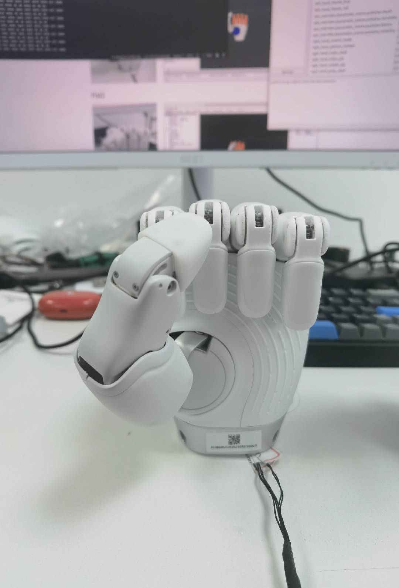
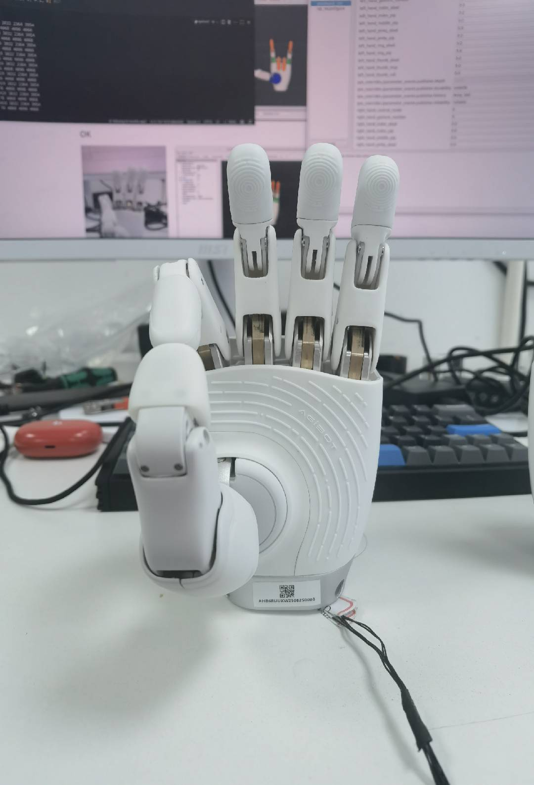
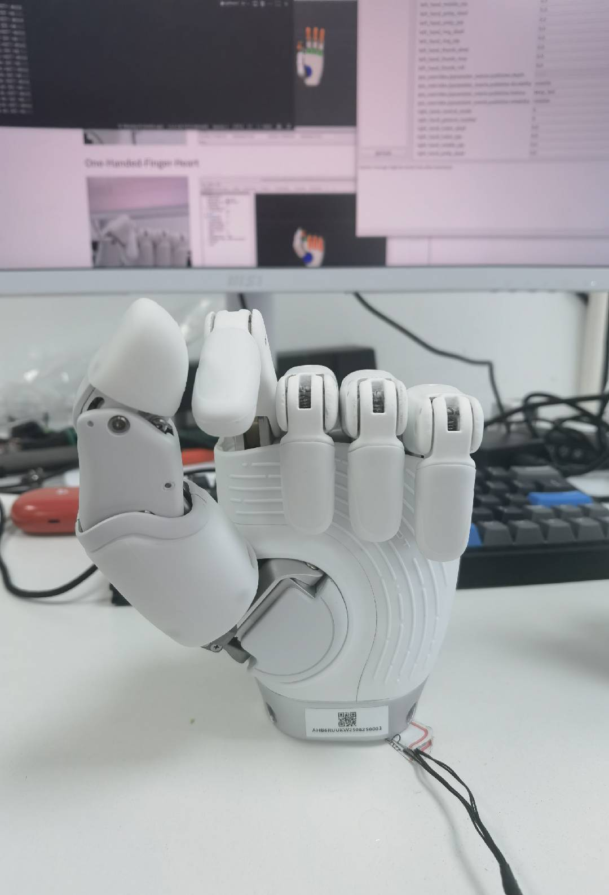
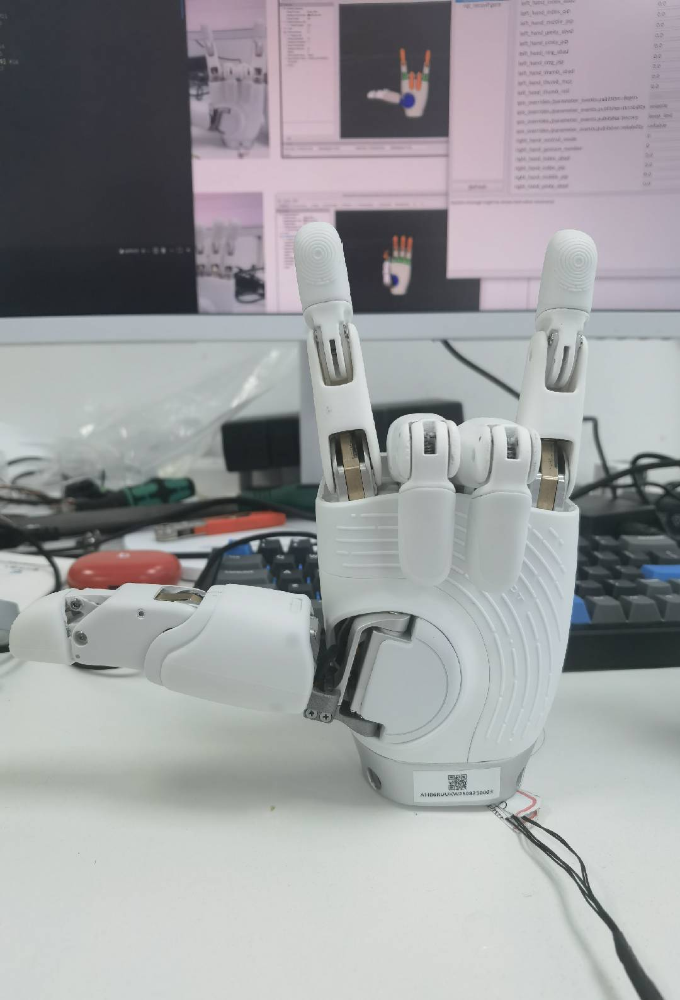
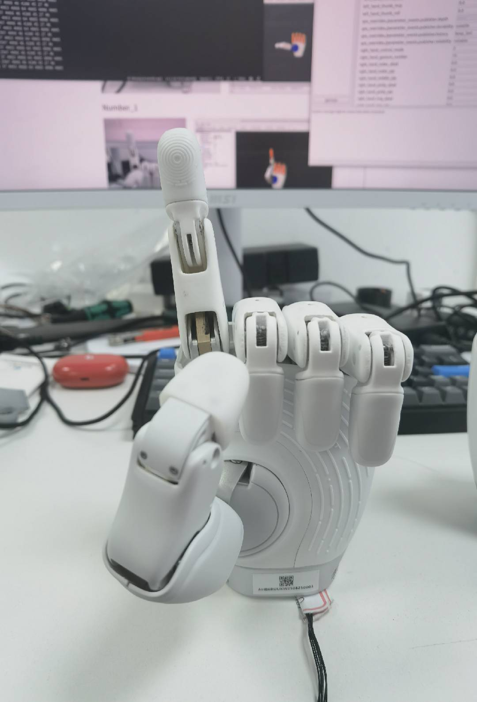
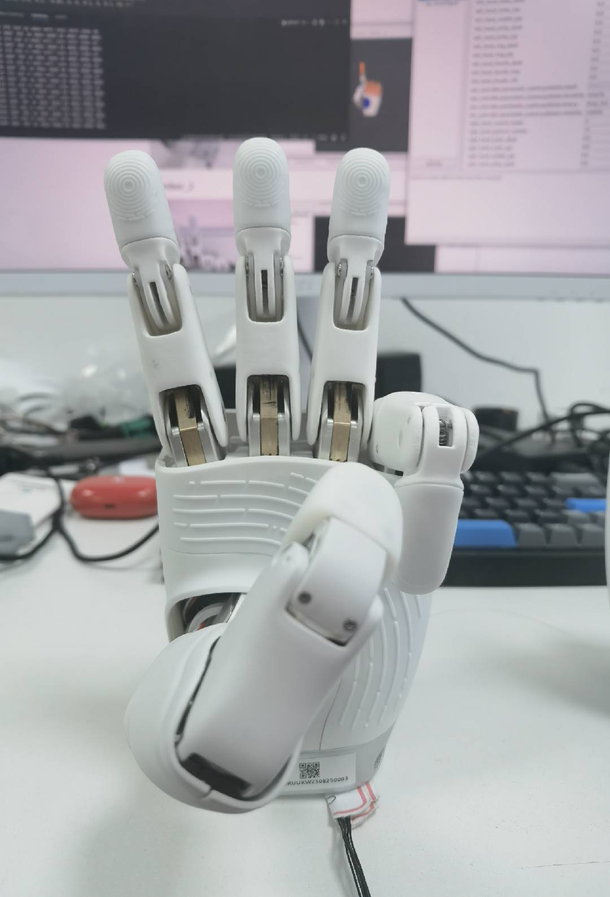
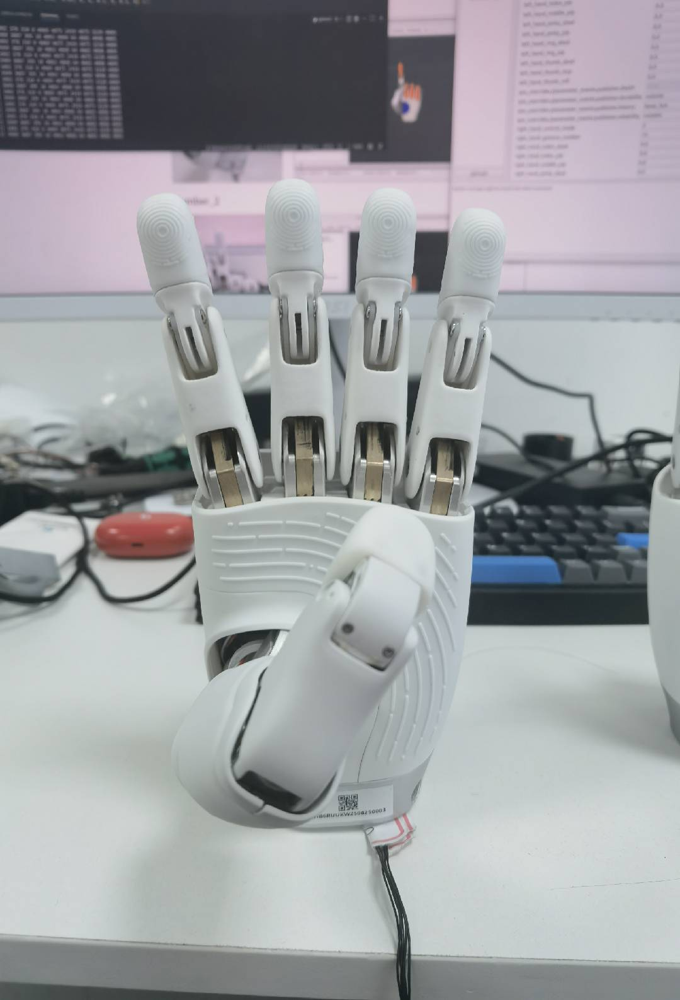
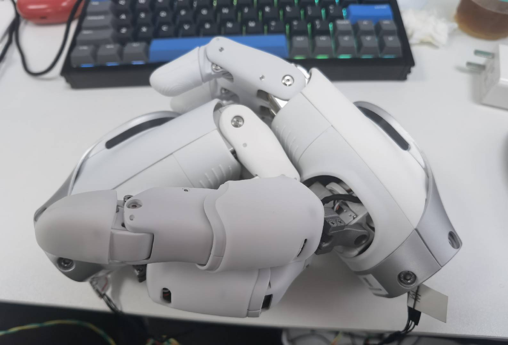

# OmniHand 2025 (O10) Kinematics Solver Python API

## Introduction

The **OmniHand2025Solver** class provides control functionalities for the OmniHand 2025 (O10) robotic hand, including gesture setting and joint position conversion.

## Import

```python
from omnihand.omnihand_2025 import OmniHand2025Solver
```

## Constructor

```python
OmniHand2025Solver(hand_type: bool)
```

- **`hand_type`**: Set to `True` for a left-hand and `False` for a right-hand.

## Methods

### 1. set_hand_gesture

```python
def set_hand_gesture(gesture: int) -> List[int]
```

- Sets a predefined hand gesture.
- Returns the corresponding actuator input values.

| gestureID | gesture name | gesture image |
|-----------|--------------|----------------|
| 0         | open hand    |  |
| 1         | fist 1       |  |
| 2         | fist 2       |  |
| 3         | OK    |  |
| 4         | One-handed finger heart       |  |
| 5         | like       |  |
| 6         | ILY    |  |
| 7         | number 1    |  |
| 8         | number 2       |  |
| 9         | number 3       |  |
| 10        | number 4    |  |
| 11        | number 6       |  |
| 12        | number 8       |  |
| 13        | hand heart 1    |  |
| 14        | hand heart 2       |  |
| 15        | hand heart 3       |  |
| 16        | clasping       |  |

### 2. active_joint_pos_to_actuator_input

```python
def active_joint_pos_to_actuator_input(active_joint_pos: List[float]) -> List[int]
```

- Converts active joint positions into actuator input values.
- **Note**: O10 motor input range is 0-4096, different from O12 which is 0-2000.

### 3. actuator_input_to_active_joint_pos

```python
def actuator_input_to_active_joint_pos(actuator_input: List[int]) -> List[float]
```

- Converts actuator input values back into active joint positions.
- **Note**: O10 motor input range is 0-4096, different from O12 which is 0-2000.

### 4. get_all_joint_pos

```python
def get_all_joint_pos(active_joint_pos: List[float]) -> List[float]
```

- Retrieves the angles of all joints, including passive joints, based on the given active joint positions.

### 5. show_log

```python
def show_log(flag: bool) -> None
```

- Controls logging output. Set to `True` to enable logging, `False` to disable.

## Code Example

```python
from omnihand.omnihand_2025 import OmniHand2025Solver

# Create solver for right hand
solver = OmniHand2025Solver(hand_type=False)

# Enable logging
solver.show_log(True)

# Set a gesture
actuator_input = solver.set_hand_gesture(1)  # FIST gesture

# Convert joint positions to actuator input
active_joint_pos = [0.5, -0.3, 0.6, 0.0, 1.0, 1.0, 0.0, 1.0, 0.0, 1.0]
input_values = solver.active_joint_pos_to_actuator_input(active_joint_pos)

# Get all joint positions (including passive joints)
all_joints = solver.get_all_joint_pos(active_joint_pos)
```

## Related Documentation

- [OmniHand 2025 (O10) Python API](API_PYTHON_O10.md) - Main Python API documentation
- [OmniHand 2025 (O10) Kinematics Solver C++ API](API_KINEMATICS_CPP_O10.md) - C++ version of this API
