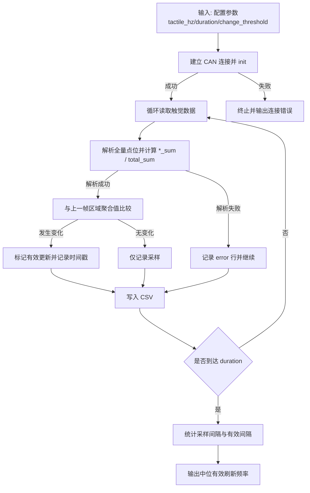

# 触觉有效刷新频率统计（L2-5-1）

`当前步骤：4/4（已完成）`

## D1. 功能总实现目标

- 通过 CAN 链路按指定频率持续读取触觉数据，记录时间戳、全量点位值与聚合值（`*_sum`、`total_sum`）。
- 在脚本内自动识别“有效数据变化事件”（多区域值发生变化），计算有效数据间隔与中位有效刷新频率。
- 保留 CSV 以支持人工复核，同时输出程序化统计结果，避免仅靠人工表格分析。

交付标准：
- 能生成结构化 CSV（前半段字段与 `l2_4_1_tactile_o10.csv` 对齐：全量点位 + 分区求和 + `total_sum`，后半段附加有效更新标记）。
- 能在终端输出采样间隔统计 + 有效更新间隔统计（中位/平均/最小/频率）。
- 能通过参数控制测试频率、时长、变化阈值、请求间隔。

## D2. 预期实现步骤（Plan 模式）

不确定项 / 待确认选项（已在本次实现前确认）：
- 有效更新判定：采用“多区域变化汇总”（`thumb/index/middle/ring/little/palm/dorsum` 任一区域变化即记为有效更新）。
- 变化阈值策略：默认 `change-threshold=0`，仅当值“实际变化（delta>0）”才计入有效更新。
- 统计输出：同时输出“采样间隔指标”和“有效更新间隔指标”。
- 文档策略：按规则三更新项目总览文档与功能文档。

### 步骤明细

- ✅ 已完成 Step 1：定义采集与 CSV 字段（对齐 L2-4 风格）
  - 步骤目标：固定采样数据结构，保证可复核。
  - 涉及文件 / 模块：`scripts/validation/l2_5_1_sensor_feedback_frequency.py`
  - 具体操作动作：CSV 前半段按 `l2_4_1_tactile_o10.csv` 生成 `elapsed_ms + 各区域全量点位 + *_sum + total_sum`，后半段追加 `is_effective_update`、`changed_regions`、`delta_total_sum`、`status/error` 字段。
  - 依赖前置：设备可通过 ZLGCAN/SocketCAN 建立连接。
  - 验收标准：脚本运行后可生成完整 CSV 且字段不缺失。
  - 风险点：底层返回数据结构可能为对象列表或平铺数组，需兼容解析。

- ✅ 已完成 Step 2：实现有效更新判定与实时统计
  - 步骤目标：从“采样频率”中剥离“有效刷新频率”。
  - 涉及文件 / 模块：`scripts/validation/l2_5_1_sensor_feedback_frequency.py`
  - 具体操作动作：维护前后两次区域聚合向量，按阈值判定变化区域；记录有效事件时间戳并计算间隔。
  - 依赖前置：Step 1 字段定义完成。
  - 验收标准：终端可输出 `effective_interval_median` 与 `effective_median_hz`。
  - 风险点：阈值为 0 时需避免“所有采样都判定为变化”。

- ✅ 已完成 Step 3：实现频率节拍控制与运行参数
  - 步骤目标：支持“指定读取频率”并稳定运行。
  - 涉及文件 / 模块：`scripts/validation/l2_5_1_sensor_feedback_frequency.py`
  - 具体操作动作：新增 `--tactile-hz`、`--duration`、`--request-interval-ms`、`--change-threshold`、`--log-interval` 参数；按周期 sleep 控制轮询节拍。
  - 依赖前置：Step 1、Step 2 完成。
  - 验收标准：`--help` 可见参数；运行时实时日志可观测平均采样频率。
  - 风险点：高频下总线拥塞会引发异常采样或无效数据。

- ✅ 已完成 Step 4：同步文档与可维护信息
  - 步骤目标：满足规则三文档规范并可持续维护。
  - 涉及文件 / 模块：`docs/project_detailed/sensor-feedback-frequency.md`、`docs/project_overview/file-map.md`、`docs/project_overview/overview.md`
  - 具体操作动作：补齐实现目标、代码详解、参数与 IO 说明、更新日志。
  - 依赖前置：代码逻辑稳定。
  - 验收标准：文档章节覆盖 D1~D7，且流程图包含异常分支。
  - 风险点：后续脚本字段调整后若文档未同步会造成口径偏差。

### Mermaid 流程图

## D3. 当前代码详解

### 文件：`scripts/validation/l2_5_1_sensor_feedback_frequency.py`

1) 连接与设备创建（`_connection_hint` / `create_hand` / `connect_hand`）
- 实现原理：根据 `product + link` 选择 O10/O12 与 ZLGCAN/SocketCAN 的创建入口，统一在 `connect_hand` 执行 `init()`。
- 调用链路：`main()` -> `connect_hand()` -> `create_hand()`。
- 关键参数：
  - `product`: `o10|o12`
  - `link`: `zlgcan|socketcan`
  - 设备参数：`hand-device-id`、`canfd-device-id`、`canfd-channel-id`、`can-interface`
- 输入/输出：
  - 输入：命令行连接参数
  - 输出：已初始化 hand 对象
- 边界条件：`create_hand` 抛异常或 `init=False` 时直接退出。
- 常见误区：仅创建对象不代表链路可用，必须检查 `init()`。

2) 触觉聚合解析（`_parse_o10_row` / `_collect_o10` / `_collect_o12`）
- 实现原理：
  - O10：读取 `get_all_tactile_sensor_data_raw()`，按 7 个区域写入全量点位，并同步计算 `*_sum` 与 `total_sum`。
  - O12：通过 `get_tactile_sensor_3d_data()` 读取拇指/食指 3D 触觉，写入 `thumb/index` 后保持与 O10 相同表头结构，其他区域留空。
- 调用链路：`main()` 循环内 -> `_collect_o10` 或 `_collect_o12`。
- 关键参数：无外部参数，依赖底层回包结构。
- 输入/输出：
  - 输入：SDK 返回的触觉原始数据
  - 输出：CSV 行字典（全量点位、`*_sum`、`total_sum`）与完整性计数（`issues`）
- 边界条件：缺区、长度不足、非整数值时标记无效。
- 常见误区：将“读取成功”与“数据完整”混为一谈；脚本中 `status=invalid` 专门区分此类情况。
- 跨脚本接口关系：
  - 与 `scripts/validation/l2_4_1_full_sensor_bandwidth_cpu.py` 一致：L2-5-1 在 O10 分支同样调用 `hand.get_all_tactile_sensor_data_raw()`。
  - 差异点：L2-5-1 仅在 O12 分支改为 `get_tactile_sensor_3d_data()`，因此 O12 结果不可直接按 O10 全量 Raw 口径对齐。

3) 有效更新判定与统计（`main` 主循环）
- 实现原理：比较相邻两次分区求和值向量（`thumb_sum...dorsum_sum`）；任一区域满足阈值条件即视为一次有效更新，记录时间戳。
- 调用链路：`main()` -> 采样循环 -> 写 CSV -> 结束后统计。
- 关键参数：
  - `change-threshold`：变化阈值
  - `tactile-hz`：采样目标频率
  - `duration`：采样时长
- 频率节拍控制（`period / spent / sleep`）：
  - `period`：目标周期（秒），计算式 `period = 1 / tactile_hz`。例如 100Hz 时 `period=0.01s=10ms`。
  - `spent`：本轮实际业务耗时（秒），从 `loop_start` 到完成读取、判定、写 CSV 的耗时。
  - `sleep(max(0, period - spent))`：补足剩余时间；若 `spent` 已超过目标周期，则 `period-spent` 为负数，`sleep(0)`，不会再等待。
  - 实际循环周期近似为 `max(spent, period)`，所以实际频率近似 `1 / max(spent, period)`。
  - 示例：100Hz 目标下，若 `spent=51ms`，则 `period-spent=10-51=-41ms`，sleep 为 0，最终频率约 `1/0.051=19.6Hz`。
- 输入/输出（示例）：
  - 输入：当前帧分区求和值 `[thumb_sum, ..., dorsum_sum]`
  - 输出：`is_effective_update`、`changed_regions`、`effective_interval_median`
- 边界条件：
  - 阈值为 0 时要求 `delta>0` 才算变化；
  - 有效更新次数 < 2 时无法计算有效间隔，脚本会提示样本不足。
- 常见误区：高采样频率不等于高有效刷新频率，必须看有效间隔统计。

## D4. 使用方法

- 运行环境：Linux + Python 3.10 + OmniHand SDK 可用 + CAN 链路可连接。
- 入口脚本：`scripts/validation/l2_5_1_sensor_feedback_frequency.py`

常用命令示例：
- 默认参数运行：
  - `python3 scripts/validation/l2_5_1_sensor_feedback_frequency.py`
- 按 100Hz 读取 30 秒并输出 CSV：
  - `python3 scripts/validation/l2_5_1_sensor_feedback_frequency.py --tactile-hz 100 --duration 30 -o l2_5_1_100hz_30s.csv`
- 使用 10 的变化阈值过滤抖动：
  - `python3 scripts/validation/l2_5_1_sensor_feedback_frequency.py --change-threshold 10`

适用场景：
- 评估“采样很高但数据变化很慢”的实际刷新能力。
- 手动挤压应力传感器并量化变化事件间隔。

## D5. 参数说明

- `--product`：设备型号（`o10|o12`）；默认 `o10`；影响读取接口与字段结构。
- `--hand`：左右手（`left|right`）；默认 `left`；影响设备句柄选择。
- `--hand-device-id`：手设备 ID；默认 `1`；用于总线上设备寻址。
- `--canfd-device-id`：CANFD 设备索引；默认 `0`；多设备场景需匹配实际连接。
- `--canfd-channel-id`：CANFD 通道索引；默认 `0`；错配会导致通信失败。
- `--can-interface`：SocketCAN 接口名；默认 `can0`；仅 `socketcan` 生效。
- `--link`：链路类型（`zlgcan|socketcan`）；默认 `zlgcan`。
- `--duration`：测试时长（秒）；默认 `10.0`；越长统计越稳定。
- `--tactile-hz`：目标读取频率（Hz）；默认 `100.0`；过高可能增加无效/异常采样概率。
- `--request-interval-ms`：SDK 最小请求间隔（ms）；默认 `0`；影响底层请求节奏。
- `--change-threshold`：有效变化阈值；默认 `0`；越大越能抑制噪声但可能漏检微小变化。
- `--log-interval`：实时日志周期（秒）；默认 `1.0`；仅影响终端输出频率。
- `--output`：CSV 输出路径；默认 `l2_5_1_sensor_feedback_frequency.csv`。

## D6. 输入输出说明

输入：
- 来源：CAN 触觉回包（O10 为全量 Raw，O12 为 3D normal force 子集）。
- 格式：
  - O10：7 区域数据或平铺数组，按区域长度切分，写入全量点位并求和。
  - O12：拇指/食指 `normal_force`。
- O10 各区域原始点位数量（Raw）：
  - `thumb`: 16
  - `index`: 18
  - `middle`: 18
  - `ring`: 18
  - `little`: 18
  - `palm`: 78
  - `dorsum`: 102
- 单位：遵循 SDK 定义；脚本仅做数值比较与求和，不转换单位。
- 约束：回包必须完整且可转为整数，异常时标记 `status=error|invalid`。

输出：
- CSV 字段：
  - 前半段：`elapsed_ms`、`thumb_0..thumb_15`、`index_0..index_17`、...、`dorsum_0..dorsum_101`、`thumb_sum..dorsum_sum`、`total_sum`（与 `l2_4_1_tactile_o10.csv` 风格对齐）
  - 后半段：`is_effective_update`、`effective_change_count`、`changed_regions`、`delta_total_sum`、`status`、`error`
- 终端统计：
  - 采样间隔中位数/平均值与采样中位频率
  - 有效间隔最小值/中位数/平均值与中位有效刷新频率
- 终端统计字段详解（对应日志 `采样统计:` 与 `有效更新统计:`）：
  - `samples`：总采样次数（循环次数），等于 `sample_ts` 记录数量；不是“有效数据条数”。
  - `valid`：完整有效样本数；当本次采样 7 个区域都完整可解析（`issues==0`）才计入。
  - `data_loss`：数据缺失/无效次数；当采样出现分区缺失、长度不足或异常时计入（包含 `status=invalid` 与 `status=error`）。
  - `exceptions`：Python 层异常次数；只统计 `try/except` 捕获到的调用异常，不包含底层 Warning 文本。
  - `sample_interval_median`：相邻两次采样时间差中位数（ms），由 `sample_ts` 计算。
  - `sample_interval_avg`：相邻两次采样时间差平均值（ms）。
  - `sample_median_hz`：采样中位频率（Hz），计算方式为 `1 / median(sample_dt)`。
  - `effective_updates`：有效更新事件总数；仅 `status=ok` 且相对上一帧存在至少一个区域变化时计入。
  - `effective_interval_min`：相邻两次有效更新的最小间隔（ms）。
  - `effective_interval_median`：相邻两次有效更新的中位间隔（ms）。
  - `effective_interval_avg`：相邻两次有效更新的平均间隔（ms）。
  - `effective_median_hz`：有效更新中位频率（Hz），计算方式为 `1 / median(effective_dt)`。
- 统计口径解读示例（你本次 100Hz/10s 结果）：
  - `samples=222` 表示 10 秒内实际循环了 222 次，平均轮询约 22Hz，而非 100Hz。
  - `valid=111` 与 `data_loss=111` 基本 1:1，说明约一半请求拿到了不完整多帧数据。
  - `sample_interval_median=51.131ms` 对应 `sample_median_hz=19.56Hz`，这是当前链路+设备在该读法下的实际可达采样节拍。
  - `effective_median_hz=11.10Hz` 低于采样频率，表示“数据真正发生变化”的速度更慢。
- 异常情况：
  - 连接失败：直接退出并打印错误。
  - 有效更新不足：提示“样本不足，无法计算有效间隔”。

`get_all_tactile_sensor_data_raw()` 相关底层日志（对应你终端 763-768）：
- `[DEBUG][MultiFrame] timeout waiting for frame 1/5 ...`
- `[Warning]: Incomplete data for sensor 4, expected 18 bytes, got 10`
- `[Warning]: Incomplete data for sensor 5, expected 18 bytes, got 10`
- `[Warning]: Incomplete data for sensor 6, expected 78 bytes, got 10`
- `[Warning]: Incomplete data for sensor 7, expected 102 bytes, got 10`

说明：
- 上述内容来自 SDK 底层多帧接收过程，不是 Python 业务层主动打印的返回值。
- 当出现该日志时，脚本会将该采样标记为 `status=invalid`，并计入 `data_loss` 观测。

## D7. 更新日志

### 2026-04-22 14:24 CST

- 改了什么：
  - 在 D3 触觉聚合解析章节中明确 O12 分支使用 `get_tactile_sensor_3d_data()`，并补充与 L2-4-1 的跨脚本接口关系说明。
- 为什么：
  - 统一回答“L2-4-1 与 L2-5-1 是否调用相同底层接口”的问题，避免将“同 SDK 接口”误解为“调用同一个 demo 文件”。
- 影响范围：
  - 文档链路口径更清晰，不改变 `scripts/validation/l2_5_1_sensor_feedback_frequency.py` 运行行为。

### 2026-04-22 12:05 CST

- 改了什么：
  - 在 D3“当前代码详解”中新增 `period / spent / sleep(max(0, period-spent))` 的完整节拍控制说明与公式示例。
- 为什么：
  - 回答“目标 100Hz 为什么实际只有约 20Hz”时，必须明确 `period-spent` 的物理含义与对实际频率的限制关系。
- 影响范围：
  - 文档可读性提升，不改变脚本逻辑与统计口径。

### 2026-04-22 11:57 CST

- 改了什么：
  - 在 D6 输出说明中新增终端统计参数逐项解释，覆盖 `samples/valid/data_loss/exceptions/sample_*` 与 `effective_*` 全字段。
  - 增加基于 `l2_5_1_100hz_10s.csv` 的口径解读示例，明确“目标频率”与“实际可达频率”的区别。
- 为什么：
  - 现场执行 `--tactile-hz 100` 时容易误解为“理论上应固定得到 1000 条有效值”，需要统一解释统计字段含义与计算方式。
- 影响范围：
  - 仅文档口径增强，不改变 `scripts/validation/l2_5_1_sensor_feedback_frequency.py` 的功能行为。

### 2026-04-22 11:10 CST

- 改了什么：
  - 在输入说明中补充 O10 各区域 Raw 点位数量：`thumb=16`、`index=18`、`middle=18`、`ring=18`、`little=18`、`palm=78`、`dorsum=102`。
- 为什么：
  - 避免将“每行打印 16 个值”误解为“每个传感器只有 16 个点位”，提升现场排查效率。
- 影响范围：
  - 文档解释口径更清晰，不改变脚本功能与统计逻辑。

### 2026-04-22 10:57 CST

- 改了什么：
  - 将 L2-5-1 的 CSV 结构说明更新为与 `l2_4_1_tactile_o10.csv` 对齐（全量点位 + `*_sum` + `total_sum`），并补充附加统计字段说明。
  - 在输入输出章节补充 `get_all_tactile_sensor_data_raw()` 的 MultiFrame timeout / Incomplete data 日志样例与归因说明。
- 为什么：
  - 满足“CSV 格式与 L2-4 接近、便于横向分析”的测试需求，同时明确底层告警日志来源。
- 影响范围：
  - `scripts/validation/l2_5_1_sensor_feedback_frequency.py` 的数据解释口径与现场排障说明。

### 2026-04-22 10:32 CST

- 改了什么：
  - 修复 `delta_sum_raw` 计算条件：仅当 `prev_sum_raw` 与 `sum_raw` 都是数值时才执行减法。
  - 新增 `_is_number` 类型检查，避免首个有效样本或异常样本后出现 `int - NoneType` 崩溃。
- 为什么：
  - 现场运行出现 `TypeError: unsupported operand type(s) for -: 'int' and 'NoneType'`，导致脚本提前退出。
- 影响范围：
  - `scripts/validation/l2_5_1_sensor_feedback_frequency.py` 的稳定性提升；统计口径不变。

### 2026-04-22 10:25 CST

- 改了什么：
  - 新建 L2-5-1 功能文档，明确“有效数据间隔”与“中位有效刷新频率”的统计口径。
  - 补充实现步骤、参数、输入输出与异常分支流程图，统一到规则三模板。
- 为什么：
  - 解决“采样频率”与“有效刷新频率”口径混淆问题，降低人工复核成本。
- 影响范围：
  - `scripts/validation/l2_5_1_sensor_feedback_frequency.py` 的使用与结果解读方式。
