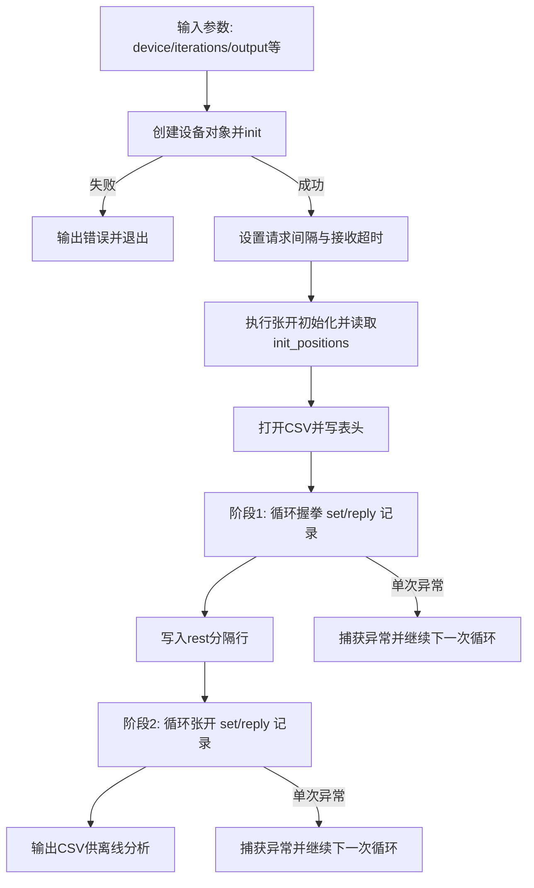

# 握拳/张开 Set+Reply 可靠性 CSV 记录

当前步骤：4/4（已完成）

## D1. 功能总实现目标

- 解决问题：验证 `set_all_joint_positions()` 在“握拳/张开”两段动作中，指令下发与设备回包是否稳定，并沉淀可复盘数据。
- 最终形态：运行一次脚本即可输出标准 CSV，包含每次发送目标位与对应回包位，支持后续离线统计与绘图分析。
- 交付标准：
  - 脚本可正常连接设备并执行双阶段动作（先握拳后张开）。
  - CSV 至少包含 `action`、`elapsed_ms`、`pos_0`~`pos_9` 字段。
  - `set` 行与 `reply` 行按动作顺序写入，可用于逐条对照。

## D2. 预期实现步骤（Plan 模式）

### 不确定项 / 待确认选项

- 是否需要把 `--positions` 参数真正接入当前动作流程：
  - 方案 A：保留现状，仅使用脚本内置的 `fist_target_positions` 与 `open_target_positions`（优点：动作口径固定，便于横向对比；缺点：可配置性较弱）。
  - 方案 B：允许用 `--positions` 覆盖其中一个阶段的目标位（优点：灵活；缺点：不同测试批次可比性下降）。
- 是否需要对 `iterations` 很大（如 > 100000）场景增加分段刷盘/轮转文件：
  - 方案 A：单文件持续写入（优点：实现简单；缺点：文件体积可能较大）。
  - 方案 B：按条数或时间滚动输出（优点：便于长期压测管理；缺点：分析时需要合并文件）。

### 分步骤计划（一步一动作）

✅ 已完成 Step 1：命令行参数与设备创建链路
- 步骤目标：脚本可按设备类型参数初始化 OmniHand 实例并设置通讯参数。
- 涉及文件 / 模块：`linux/x64/python/demo/omnihand_2025/demo_set_get_fist_reliability_csv.py`
- 具体操作动作：解析 `--device`、`--interval_ms`、`--timeout_ms` 等参数；按设备类型调用不同工厂方法创建设备对象。
- 依赖前置：设备驱动与物理链路可用。
- 验收标准：执行 `python ... --help` 正常展示参数；联机执行后无“Failed to create hand/initialize hand”错误。
- 风险点：设备类型与现场链路不匹配导致初始化失败。

✅ 已完成 Step 2：动作编排与初始姿态校准
- 步骤目标：在正式记录前先执行张开初始化，降低起始状态随机性。
- 涉及文件 / 模块：同上。
- 具体操作动作：定义 `open_target_positions` 与 `fist_target_positions`；先下发张开目标，等待后读取初始位置用于人工观察。
- 依赖前置：Step 1 完成。
- 验收标准：终端可打印 `init_positions`，且手部有可见动作响应。
- 风险点：初始化动作失败会影响后续数据可解释性。

✅ 已完成 Step 3：CSV 结构定义与握拳阶段写入
- 步骤目标：记录“发送目标 + 回包值 + 相对时间”。
- 涉及文件 / 模块：同上。
- 具体操作动作：定义 CSV 表头；在循环内依次写入 `set` 行与 `reply` 行，`reply` 携带 `elapsed_ms`。
- 依赖前置：Step 2 完成。
- 验收标准：输出文件存在且首行表头正确，文件内出现成对的 `set/reply` 行。
- 风险点：异常分支被 `try/except` 吞掉后，可能降低问题可观测性。

✅ 已完成 Step 4：张开阶段写入与完整输出
- 步骤目标：在握拳阶段后追加“rest 标记 + 张开阶段”数据，形成完整双阶段样本。
- 涉及文件 / 模块：同上。
- 具体操作动作：写入 `rest` 分隔行；重置计时后执行张开循环并写入 `set/reply`。
- 依赖前置：Step 3 完成。
- 验收标准：CSV 中包含 `rest` 行，且后续继续出现张开阶段的 `set/reply` 数据。
- 风险点：长时间运行时 CSV 体积增长较快，需评估存储与后处理耗时。

### Mermaid 流程图

## D3. 当前代码详解

### 文件级说明

- 文件路径：`linux/x64/python/demo/omnihand_2025/demo_set_get_fist_reliability_csv.py`
- 主入口：`main()`
- 实现原理：
  - 通过命令行参数决定通讯后端和测试规模；
  - 先完成设备初始化与通信参数设置；
  - 以“握拳 -> rest -> 张开”的顺序下发目标位；
  - 每次写入发送目标和回包值，构成可复盘的时序日志。

### 调用链路

- CLI 启动 -> `argparse` 解析参数
- 根据 `--device` -> 调用 `OmniHand2025.create_hand_by_*`
- `hand.init()` 初始化设备
- `hand.set_request_interval()` / `hand.set_frame_recv_timeout()`
- `hand.set_all_joint_positions()` 下发目标位并接收返回
- `csv.DictWriter.writerow()` 写入结果

### 关键参数与数据结构

- `open_target_positions` / `fist_target_positions`：
  - 类型：`list[int]`，长度 10；
  - 含义：十个关节的目标位置数组；
  - 单位：设备位置计数值（脚本注释中约束为 `0~4096` 范围）；
  - 示例：`[4087, 18, ...]`（张开）与 `[4087, 4085, ...]`（握拳）。
- `csv_header`：
  - 类型：`list[str]`；
  - 含义：CSV 字段定义，固定为 `action`、`elapsed_ms`、`pos_0`~`pos_9`。

### 输入 / 输出与边界条件

- 输入：
  - 来自 CLI 的设备参数、循环次数、输出路径；
  - 来自硬件回包的关节位置数组。
- 输出：
  - 终端输出：`init_positions` 与失败提示；
  - 文件输出：CSV 行记录（`set/reply/rest`）。
- 边界条件：
  - `iterations < 1` 时会被强制修正为 1；
  - `timeout_ms` 会被限制到 `10~1000`；
  - 循环中的单次异常被捕获后继续执行，测试不会立即中断。

### 常见误区

- 误区 1：以为 `--positions` 会覆盖当前握拳/张开动作。
  - 实际上当前脚本仍使用内置两组目标位，`--positions` 未接入动作主流程。
- 误区 2：把 `elapsed_ms` 理解为每一条 `set` 行耗时。
  - 实际上 `elapsed_ms` 只在 `reply` 行写入，表示从该阶段起始时刻到当前回包的相对时间。

## D4. 使用方法

### 运行方式

- 入口文件：`linux/x64/python/demo/omnihand_2025/demo_set_get_fist_reliability_csv.py`
- 典型命令：
  - 查看帮助：`python3 linux/x64/python/demo/omnihand_2025/demo_set_get_fist_reliability_csv.py --help`
  - 默认运行：`python3 linux/x64/python/demo/omnihand_2025/demo_set_get_fist_reliability_csv.py`
  - 指定循环次数和输出：`python3 linux/x64/python/demo/omnihand_2025/demo_set_get_fist_reliability_csv.py -n 2000 -o fist_open_test.csv`

### 适用场景

- 验证握拳/张开循环动作在当前通讯链路下的稳定性。
- 对比目标位与回包位偏差，为后续统计分析提供原始数据。
- 现场复现偶发动作异常并回放时序。

## D5. 参数说明

- `-d, --device`
  - 含义：选择设备通讯后端；
  - 默认值：`zlgcan`；
  - 可选范围：`zlgcan` / `hcan` / `rs485` / `zlgcan_tcp`；
  - 影响：决定底层创建函数与连接参数。
- `-i, --interval_ms`
  - 含义：SDK 请求间隔（毫秒）；
  - 默认值：`0`（代码注释写了 10，但实际默认是 0）；
  - 可选范围：整数，最终会被裁剪为 `>=0`；
  - 影响：间隔越小，请求更密集，总线负载更高。
- `-n, --iterations`
  - 含义：每个动作阶段的循环次数；
  - 默认值：`1000`；
  - 可选范围：整数，最终会被裁剪为 `>=1`；
  - 影响：值越大，CSV 样本越多，测试耗时更长。
- `-o, --output`
  - 含义：输出 CSV 路径；
  - 默认值：`same_set_get_reliability.csv`；
  - 可选范围：任意可写文件路径；
  - 影响：决定结果文件名与保存位置。
- `--timeout_ms`
  - 含义：接收帧超时（毫秒）；
  - 默认值：`30`；
  - 可选范围：整数，最终会被限制在 `10~1000`；
  - 影响：过小可能造成误判超时，过大可能掩盖链路抖动。
- `--positions`
  - 含义：预留的目标位字符串（逗号分隔）；
  - 默认值：`2048,0,0,0,0,0,0,0,0,4095`；
  - 可选范围：逗号分隔整数；
  - 影响：当前版本仅完成解析，未进入主要握拳/张开写入流程。

## D6. 输入输出说明

### 输入

- 来源：命令行参数 + 设备回包。
- 格式：
  - 参数格式：CLI 选项（字符串/整数）；
  - 回包格式：长度最多 10 的位置数组。
- 关键字段与约束：
  - `iterations` 必须是正整数（脚本会兜底到最小 1）；
  - `timeout_ms` 最终会落在 `10~1000`；
  - 目标位建议满足设备位置范围约束（通常 `0~4096`）。

### 输出

- 输出格式：UTF-8 编码 CSV。
- 字段说明：
  - `action`：`set` / `reply` / `rest`；
  - `elapsed_ms`：阶段内相对毫秒，仅 `reply` 行有值；
  - `pos_0`~`pos_9`：10 个关节位置值（发送值或回包值）。
- 去向：由 `--output` 指定路径，默认写到当前工作目录下 `same_set_get_reliability.csv`。
- 异常情况：
  - 设备创建或初始化失败：直接终止并打印错误；
  - 循环内单次异常：跳过该次写入，继续后续循环。

## D7. 更新日志

### 2026-04-22 09:58 CST

- 改了什么：
  - 新建本功能文档，完整补齐 D1~D7 章节、步骤状态标记与 Mermaid 流程图。
  - 明确脚本默认 CSV 文件名为 `same_set_get_reliability.csv`，并补充参数、输入输出、边界条件说明。
- 为什么改：
  - 让新同事可快速理解该脚本如何运行、如何产出数据、如何配置参数，降低联机验证沟通成本。
- 影响范围：
  - 文档层更新，不改变脚本运行逻辑。
